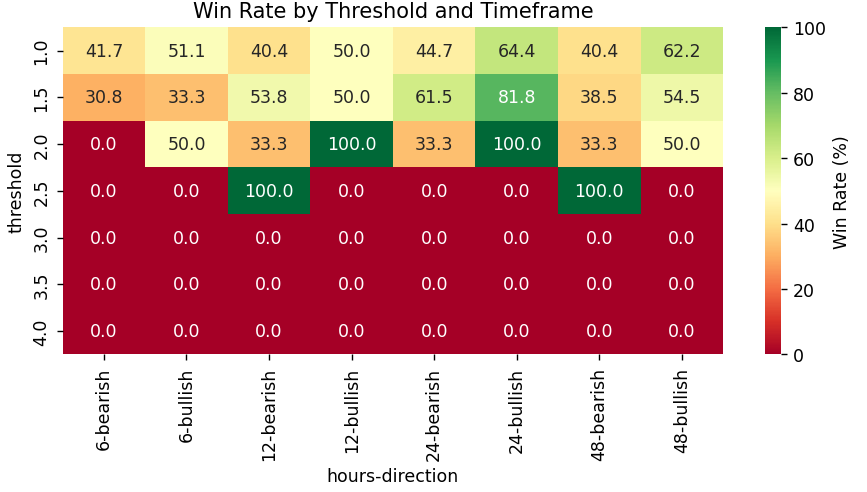
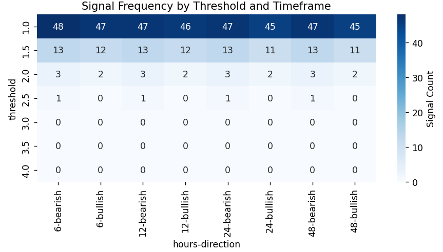
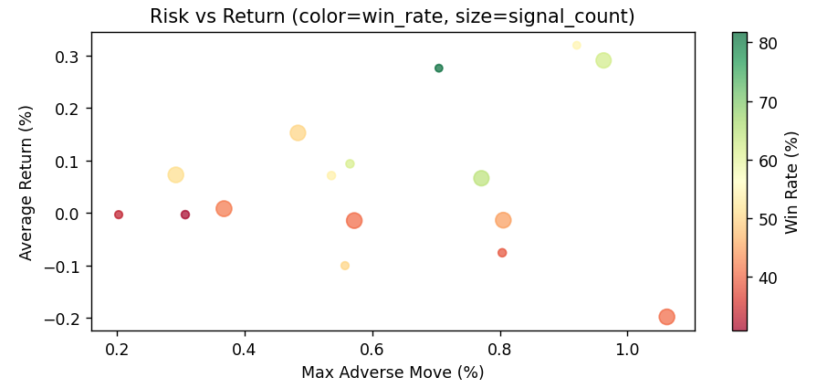
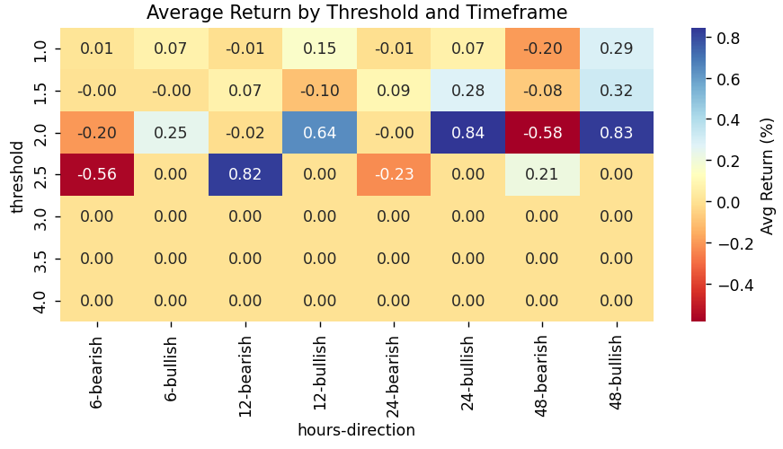

# 📊 Gold Statistical Research

A research repository exploring statistical and technical methods to exploit favorable probabilities in the **Gold (XAUUSD)** market. The core question:  
> *Is it possible to consistently identify high-probability price movements that can be used to generate profit?*

I use momentum analysis, backtesting, and session-based behavior to find actionable patterns.

---

## PHASE ONE

**Main Question:**  
Can we identify a **minimum percentage move** in a 4H/1H candle that leads to **continued movement over the next 24+ hours** with >75% probability?

---

## ⚙️ Research Pipeline

### 1. 🧬 Data Collection  
- Source: [Yahoo Finance](https://finance.yahoo.com) & [Kaggle (XAUUSD dataset)](https://www.kaggle.com/datasets/novandraanugrah/xauusd-gold-price-historical-data-2004-2024)  
- Timeframe: 2 years of 4H candles (~3,107 samples)  
- Script: [`download_data()`](./xauusd_analyzer.py#L16) / [`load_csv_data()`](./xauusd_analyzer.py#L40)

---

### 2. 🧹 Data Preparation  
- Calculates percentage change per candle  
- Classifies trading sessions (London / NY / Asian)  
- Adds volume percentiles  
- Script: [`prepare_data()`](./xauusd_analyzer.py#L49)

---

### 3. 📈 Momentum Persistence Analysis  
- Tests thresholds: `1.0%` → `4.0%`  
- Forward returns measured at: `6H`, `12H`, `24H`, `48H`  
- Analyzes:
  - Win rate
  - Average return
  - Max Adverse Excursion  
- Script: [`analyze_momentum_persistence()`](./xauusd_analyzer.py#L81)

---

### 4. 📊 Signal Quality Metrics  
Script: [`analyze_signal_group()`](./xauusd_analyzer.py#L118)

- ✅ **Win Rate**: % of trades in expected direction  
- 📉 **Max Drawdown**: Largest loss before move continuation  
- 🔁 **Frequency**: How often the signal appears  
- 📈 **Average Return**: Mean return across instances

---

### 5. 🕒 Session-Based Performance  
- Segments results by session: **London**, **New York**, **Asian**  
- Combines volume percentile for filtering  
- Visualizes risk-return tradeoffs by session  
- Investigates which sessions yield more reliable signals

---

## 🧠 Key Findings

### ✅ High-Probability Setups (Rare but Reliable)

| Threshold | Timeframe | Direction | Win Rate | Avg Return | Signals |
|-----------|-----------|-----------|----------|------------|---------|
| 2.0%      | 24H       | Bullish   | 100%     | 0.84%      | 2       |
| 2.5%      | 12H       | Bearish   | 100%     | 0.82%      | 2       |

---

### ⚖️ Tradeable Frequency Setups (Balanced Risk)

| Threshold | Timeframe | Direction | Win Rate | Avg Return | Signals |
|-----------|-----------|-----------|----------|------------|---------|
| 1.5%      | 24H       | Bullish   | 81.8%    | 0.28%      | 11      |
| 1.0%      | 24H       | Bullish   | 64.4%    | 0.07%      | 45      |

---

## 📊 Visual Highlights

<table>
  <tr>
    <td align="center"><br/><sub><b>Win Rate Heatmap</b></sub></td>
    <td align="center"><br/><sub><b>Signal Frequency</b></sub></td>
  </tr>
  <tr>
    <td align="center"><br/><sub><b>Risk vs Reward</b></sub></td>
    <td align="center"><br/><sub><b>Return Distribution</b></sub></td>
  </tr>
</table>

---

## 📌 Summary of Insights

- ✅ **Momentum Persistence Exists**: ≥2.0% 4H moves often persist over 24H  
- 🔁 **Trade-off Observed**: 1.5% is the sweet spot between reliability and frequency  
- ⚠️ **Drawdowns Manageable**: Max adverse excursion <1% on average  
- 🧪 **Session Context Matters**: London + High Volume = more consistent moves

---

## ⚠️ Limitations

- Only 2 years of data used in initial test  
- Few samples for extreme moves (e.g., 2.5%+)  
- No modeling of:
  - Spread / slippage
  - Economic events (NFP, CPI)
  - Volatility regimes  
- Purely signal-based; no exit logic yet

---

## 🧭 Roadmap for PHASE TWO

### 🟡 Phase 1: **Historical Expansion**
- Load full 2004–2025 dataset
- Test across different market regimes

### 🔵 Phase 2: **Strategy Refinement**
- Add volume and DXY filters  
- Avoid high-impact macro events  
- Test multi-timeframe confluence  

### 🟢 Phase 3: **Practical Simulation**
- Build rule-based system with SL, TP, position sizing  
- Paper trade using €50 capital  
- Include spread, slippage, fees

### 🟣 Phase 4: **Automation & Deployment**
- MT4/MT5 Signal bot  
- Alerts + dashboard  
- Gradual capital scaling based on stats

---

## ▶️ How to Run

```bash
pip install pandas numpy matplotlib seaborn yfinance scipy
python xauusd_analyzer.py
```

## PHASE TWO
### Expanding based on initial findings
